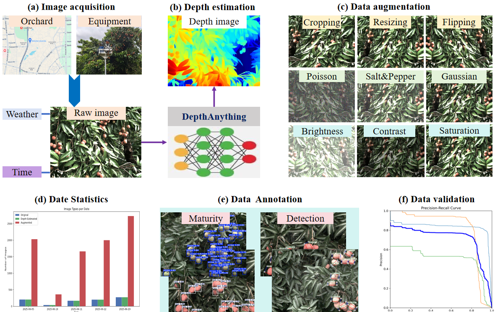
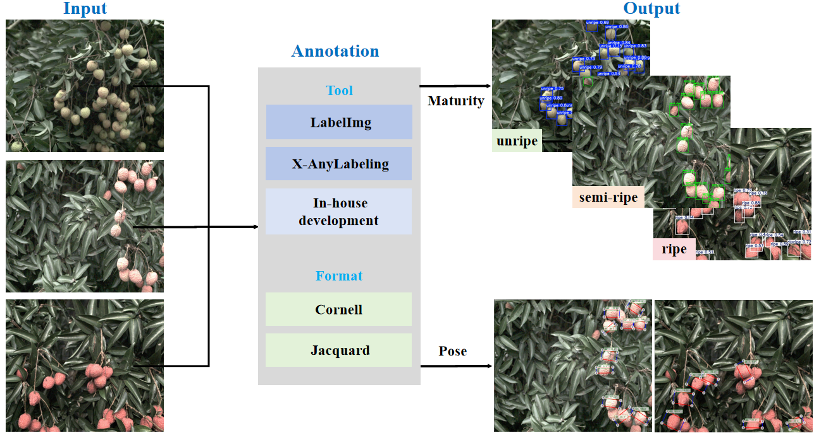
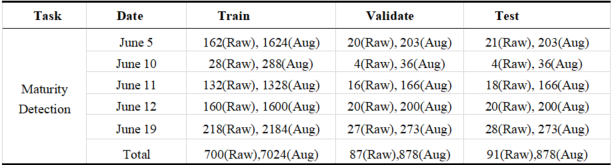

# 🍒 Lychee Dataset
we constructed a new lychee dataset with the advantages of rich data types, large intra-class variations, diverse and comprehensive annotation formats, and well-defined maturity classifications.

<p align="center">
  
</p>

---


## 📌 Introduction
(1) It comprises 11,414 high-resolution images of multiple lychee varieties at different maturity stages, collected from major lychee-producing regions in China, covering broader varietal diversity, varying exposure levels, and diverse weather conditions; 
(2) It provides high-quality, standardized maturity annotations for all images, as well as harvest annotations in two acquisition formats for ripe and unharvested lychees;
(3) The dataset exhibits greater diversity, with splits by date and scene, enabling flexible use depending on algorithmic platforms or application scenarios; 
(4) In addition to original images, it also includes augmented images and depth maps, and is released in an open-source format, aiming to promote standardized research in agricultural visual inspection and provide strong data support for the real-world deployment of intelligent picking robots.


| 🍒 Dataset | 🌦️ Environment | 🏞️ Scene | 📷 Modality | 🧩 Tasks | 🏷️ Annotation | 🖼️ Resolution |
|------------|----------------|-----------|-------------|----------|----------------|----------------|
| **Lychee** | ☀️🌧️ Morning, noon, evening <br> 3 weeks of maturity | 🏠 Indoor (on-table) <br> 🌳 Outdoor (on-tree) | 📸 9658 (RGB) <br> 📡 1756 (Depth) | 🔍 3 (detection) <br> ✋ Custom (grasp) | 📦 Boxes (detection) <br> 📐 Rotate rectangle (grasp) | 🖼️ 1280×1024 |


---

## 📂 Dataset Structure
# 🍒 Lychee Dataset Structure

```text
Lychee/
├── data/
│   ├── 250605/
│   │   ├── detection/
│   │   │   ├── raw/
│   │   │   │   ├── full/
│   │   │   │   │   ├── images/
│   │   │   │   │   └── labels/
│   │   │   │   └── split/
│   │   │   │       ├── test/
│   │   │   │       │   ├── images/
│   │   │   │       │   └── labels/
│   │   │   │       ├── train/
│   │   │   │       │   ├── images/
│   │   │   │       │   └── labels/
│   │   │   │       └── val/
│   │   │   │           ├── images/
│   │   │   │           └── labels/
│   │   │   ├── depth_estimate/
│   │   │   │   ├── color/
│   │   │   │   ├── gray/
│   │   │   ├── augmentation/
│   │   │   │   ├── full/
│   │   │   │   │   ├── images/
│   │   │   │   │   └── labels/
│   │   │   │   └── split/
│   │   │   │       ├── test/
│   │   │   │       │   ├── images/
│   │   │   │       │   └── labels/
│   │   │   │       ├── train/
│   │   │   │       │   ├── images/
│   │   │   │       │   └── labels/
│   │   │   │       └── val/
│   │   │   │           ├── images/
│   │   │   │           └── labels/
│   │   │   ├── depth_estimate/
│   │   │   │   ├── color/
│   │   │   │   ├── gray/
│   │   ├── grasp/
│   │   │   ├── labels/
│   │   │   ├── images/
│   │   │   │   ├── corcell/
│   │   │   │   └── jacquard/
│   ├── 250610_table/
│   │   ├── detection/
│   │   └── grasp/#empty
│   ├── 250611_rain/
│   │   ├── detection/
│   │   └── grasp/
│   ├── 250612/
│   │   ├── detection/
│   │   └── grasp/
│   └── 250619/
│       ├── detection/
│       └── grasp/
├── script/
├── doc/
└── README.md


---


## 📝 Annotation Format
- Format:
  - detection: **YOLO v5/v8** (`.txt`)  
  - grasp: **jacquard/corcell** (`.txt`)  


<p align="center">
  
</p>


---
## 🔢 Dataset Statistics


###  Raw data statistics
<p align="center">
  
</p>


###  Detection annotation statistics
<p align="center">
  
</p>


###  Grasping annotation statistics
<p align="center">
  
</p>


---


## 🌱 Applications
- 🍒 Automated lychee harvesting robots  
- 🍃 Yield estimation and growth monitoring  
- 📊 Ripeness classification for market selection  


---


## 🚀 Usage Example
We mixed the original and augmented images of maturity detection from the same date, randomly shuffled the image order, and split them into training, validation, and test sets with a ratio of 8:1:1. This design allows users to flexibly select subsets according to their task requirements and computational resources. For example, on devices with limited computational capacity, subsets from individual dates can be used independently, whereas on devices with sufficient resources, multiple subsets or the entire dataset can be combined for training.

<p align="center">
  
</p>


---


@dataset{lychee2025,
  author = {Zhenpeng Zhang, Yi Wang, Shanglei Chai, Yingying Liu, Zekai Xie, Wenhao Huang, Pengyu Li, Zipei Luo, Dajiang Lu*, and Yibin Tian*},
  title  = {A Benchmark Dataset for Lychee Detection and Maturity Classification for Robotic Harvesting},
  year   = {2025},
  url    = {https://github.com/SeiriosLab/Lychee/}
}
